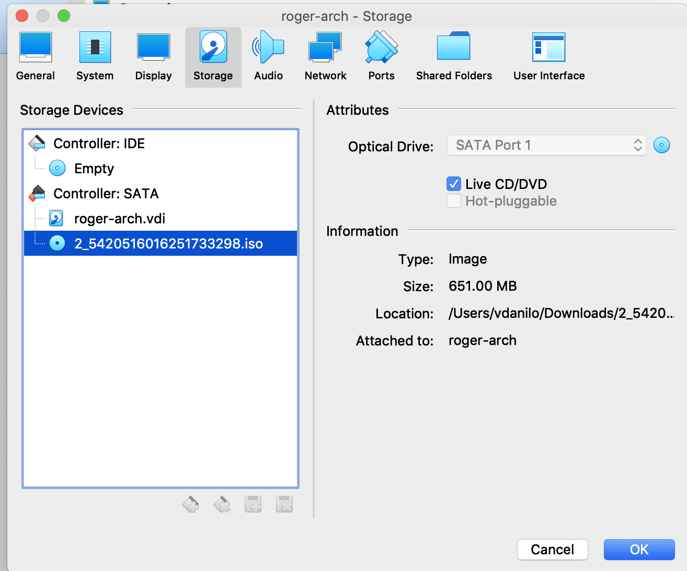
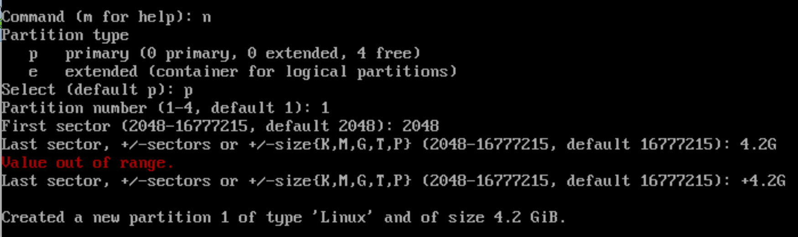
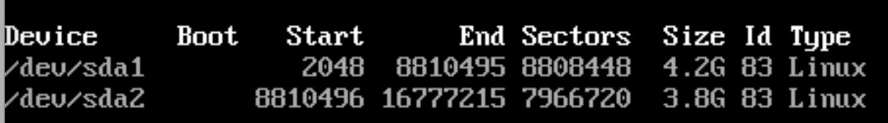

# school21_roger-skyline-1
## installation
Get relevant iso from official page.
Find literally any tutorial "how install arch linux on virtualbox". Do it until partitioning.

## partition
With the commands fdisk -l or lsblk we discover that our harddisk is named /dev/sda.
`lsblk lists information about all available or the specified block
       devices.  The lsblk command reads the sysfs filesystem and udev db to
       gather information. If the udev db is not available or lsblk is
       compiled without udev support than it tries to read LABELs, UUIDs and
       filesystem types from the block device. In this case root permissions
       are necessary.`

You can use fdisk, gdisk or parted. cfdisk is more or less graphical partitioning tool. cfdisk didn't work for me, so I used fdisk:
`fdisk /dev/sda`
fdisk commands:

View full table: `p`
I created second partition of same type just because, whatever. So, my final table looks this way:

Next we write partition table and exit:
```
w
q
```
At this point do `reboot`. Yupee, we did partition ~UwU~
Update all packages: `pacman -Syu`
At this point I had a problen with mirrors and tired. See you next time.
## update packages

## add a non-root user
https://wiki.archlinux.org/index.php/Users_and_groups

## static IP possible solution
https://dominicm.com/configure-static-ip-on-arch-linux/

## change SSH
https://linuxhint.com/arch_linux_ssh_server/

## SSH public key
https://stackoverflow.com/questions/3828164/how-do-i-access-my-ssh-public-key


